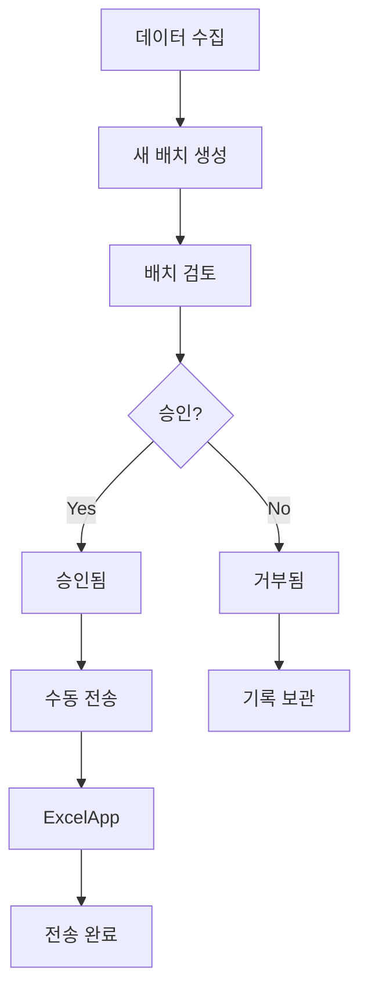

# PipeData 관리자 가이드

## 개요

PipeData 관리자 시스템은 수집된 Excel Q&A 데이터를 검토하고 ExcelApp으로 수동 전송할 수 있는 관리 인터페이스를 제공합니다.

## 주요 기능

### 🔍 데이터 검토 및 품질 관리
- 수집된 데이터 배치별 검토
- 품질 점수 기반 필터링
- JSON, CSV, Excel 형식으로 데이터 다운로드

### ✅ 수동 승인 시스템
- 배치별 승인/거부 결정
- 검토 노트 작성
- 승인 이력 추적

### 📤 수동 전송 관리
- 승인된 배치만 ExcelApp으로 전송
- 전송 성공/실패 모니터링
- 전송 이력 관리

## 시스템 구조

```
┌─────────────────┐    ┌─────────────────┐    ┌─────────────────┐
│   데이터 수집    │    │  관리자 검토     │    │   ExcelApp     │
│ (자동/연속수집)  │───▶│  (수동 승인)    │───▶│  (수동 전송)    │
└─────────────────┘    └─────────────────┘    └─────────────────┘
                            │
                            ▼
                       ┌─────────────────┐
                       │   관리 DB       │
                       │ (배치/이력관리)  │
                       └─────────────────┘
```

## 환경 설정

### 관리자 토큰 설정

Railway 환경 변수에서 설정:
```bash
ADMIN_TOKEN=your-super-secure-admin-token-here
DATA_RETENTION_DAYS=30
```

### 로컬 개발 환경

```bash
# .env 파일에 추가
ADMIN_TOKEN=admin-dev-token
PIPEDATA_API_URL=http://localhost:8000
EXCELAPP_API_URL=https://your-excelapp.com/api/training/pipedata
EXCELAPP_API_TOKEN=your-excelapp-token
```

## API 사용법

### 1. 인증

모든 관리자 API는 Bearer 토큰 인증이 필요합니다:

```bash
Authorization: Bearer your-admin-token
```

### 2. 새 배치 생성

```bash
curl -X POST https://your-pipedata.railway.app/api/admin/batches/create \
  -H "Authorization: Bearer your-admin-token" \
  -H "Content-Type: application/json" \
  -d '{
    "min_quality": 7.0,
    "max_items": 100
  }'
```

**응답:**
```json
{
  "status": "success",
  "batch_id": "a1b2c3d4e5f6g7h8",
  "message": "Batch created with ID: a1b2c3d4e5f6g7h8"
}
```

### 3. 대기 중인 배치 조회

```bash
curl https://your-pipedata.railway.app/api/admin/batches/pending \
  -H "Authorization: Bearer your-admin-token"
```

**응답:**
```json
{
  "status": "success",
  "batches": [
    {
      "batch_id": "a1b2c3d4e5f6g7h8",
      "created_at": "2025-01-19T10:30:00Z",
      "total_items": 85,
      "avg_quality_score": 8.2,
      "sources": ["stackoverflow", "reddit"],
      "status": "pending",
      "reviewed_by": null,
      "reviewed_at": null,
      "notes": null
    }
  ]
}
```

### 4. 배치 데이터 상세 조회

```bash
curl https://your-pipedata.railway.app/api/admin/batches/a1b2c3d4e5f6g7h8/data \
  -H "Authorization: Bearer your-admin-token"
```

### 5. 배치 데이터 내보내기

```bash
curl -X POST https://your-pipedata.railway.app/api/admin/batches/a1b2c3d4e5f6g7h8/export \
  -H "Authorization: Bearer your-admin-token" \
  -H "Content-Type: application/json" \
  -d '{
    "format": "excel",
    "admin_id": "admin-user"
  }'
```

**지원 형식:**
- `json`: JSON 형식
- `csv`: CSV 형식  
- `excel`: Excel 형식 (통계 시트 포함)

### 6. 배치 검토 (승인/거부)

```bash
curl -X POST https://your-pipedata.railway.app/api/admin/batches/a1b2c3d4e5f6g7h8/review \
  -H "Authorization: Bearer your-admin-token" \
  -H "Content-Type: application/json" \
  -d '{
    "action": "approve",
    "admin_id": "admin-user",
    "notes": "품질이 우수하고 ExcelApp에 유용할 것으로 판단됨"
  }'
```

**action 값:**
- `approve`: 승인
- `reject`: 거부

### 7. 승인된 배치 전송

```bash
curl -X POST https://your-pipedata.railway.app/api/admin/batches/a1b2c3d4e5f6g7h8/send \
  -H "Authorization: Bearer your-admin-token" \
  -H "Content-Type: application/json" \
  -d '{
    "admin_id": "admin-user"
  }'
```

**응답:**
```json
{
  "status": "success",
  "batch_id": "a1b2c3d4e5f6g7h8",
  "items_sent": 85,
  "message": "Batch sent successfully"
}
```

### 8. 전송 이력 조회

```bash
curl https://your-pipedata.railway.app/api/admin/transmission-history?limit=20 \
  -H "Authorization: Bearer your-admin-token"
```

### 9. 통계 대시보드

```bash
curl https://your-pipedata.railway.app/api/admin/stats \
  -H "Authorization: Bearer your-admin-token"
```

## 웹 대시보드 사용법

### 접속 및 로그인

1. 대시보드 URL 접속: `https://your-pipedata.railway.app/admin`
2. 관리자 토큰 입력
3. "로그인" 버튼 클릭

### 메인 기능

#### 1. 통계 카드
- **총 배치**: 생성된 전체 배치 수
- **총 데이터**: 수집된 총 Q&A 수와 평균 품질 점수
- **전송 완료**: ExcelApp으로 전송된 데이터 수
- **전송 배치**: 전송 완료된 배치 수

#### 2. 대기 중인 배치 탭
- 검토가 필요한 배치 목록
- 각 배치별 상세 정보 (아이템 수, 품질 점수, 소스 등)
- 배치별 작업 버튼:
  - 👁️ **보기**: 배치 데이터 상세 조회
  - 📝 **검토**: 승인/거부 결정
  - 📤 **전송**: 승인된 배치 ExcelApp 전송
  - 📥 **다운로드**: JSON/CSV/Excel 형식으로 내보내기

#### 3. 전송 이력 탭
- ExcelApp으로 전송된 배치 이력
- 전송 성공률 및 오류 통계
- 전송 일시 및 담당자 정보

### 워크플로우



## 데이터 품질 기준

### 자동 필터링
- **최소 품질 점수**: 7.0 이상
- **질문 길이**: 최소 10자 이상
- **답변 길이**: 최소 20자 이상
- **중복 제거**: 동일한 질문/답변 쌍 제거

### 수동 검토 기준
- **콘텐츠 관련성**: Excel 업무와 직접적인 관련성
- **답변 정확성**: 기술적으로 정확하고 실용적인 답변
- **언어 품질**: 문법과 맞춤법이 올바른 한국어
- **예제 코드**: 실제 작동하는 Excel 수식/매크로

## 보안 주의사항

### 1. 토큰 관리
- 관리자 토큰은 절대 공개하지 않음
- 정기적인 토큰 갱신 (월 1회 권장)
- 토큰 노출 시 즉시 변경

### 2. 데이터 보호
- 다운로드한 데이터 파일 보안 관리
- 검토 후 임시 파일 삭제
- 개인정보 포함 여부 확인

### 3. 접근 제한
- 관리자 계정 최소 권한 원칙
- 검토 활동 로그 기록
- 의심스러운 활동 모니터링

## 트러블슈팅

### 일반적인 문제

**1. 인증 실패**
```
오류: 401 Unauthorized
해결: 관리자 토큰 확인 및 환경 변수 설정 점검
```

**2. 배치 생성 실패**
```
오류: No new data available
해결: 데이터 수집 상태 확인, quality_threshold 조정
```

**3. 전송 실패**
```
오류: Failed to send batch to ExcelApp
해결: ExcelApp API 상태 확인, 네트워크 연결 점검
```

**4. 데이터 내보내기 오류**
```
오류: Export failed
해결: 디스크 공간 확인, 파일 권한 점검
```

### 로그 확인

```bash
# API 서버 로그
railway logs --tail

# 관리자 활동 로그 (데이터베이스)
sqlite3 data/admin_management.db "SELECT * FROM admin_actions ORDER BY timestamp DESC LIMIT 10;"
```

## 백업 및 복구

### 데이터베이스 백업

```bash
# SQLite 백업
cp data/admin_management.db data/admin_backup_$(date +%Y%m%d).db

# PostgreSQL 백업 (Railway)
railway connect postgres
pg_dump database_name > admin_backup.sql
```

### 설정 백업

```bash
# 환경 변수 백업
railway variables > env_backup.txt

# 배포 설정 백업
cp railway.toml railway_backup.toml
```

## 모니터링

### 주요 메트릭

1. **배치 처리율**
   - 일일 생성된 배치 수
   - 평균 검토 시간
   - 승인/거부 비율

2. **전송 성공률**
   - ExcelApp 전송 성공률
   - 평균 전송 시간
   - 오류 발생 빈도

3. **데이터 품질**
   - 평균 품질 점수 추세
   - 소스별 품질 분포
   - 거부된 배치 사유 분석

### 알림 설정

Railway 대시보드에서 설정:
- API 응답 시간 초과
- 메모리 사용량 임계값
- 오류 발생 빈도

## 유지보수

### 정기 작업

**주간 작업:**
- 전송 이력 검토
- 오류 로그 분석
- 품질 점수 트렌드 확인

**월간 작업:**
- 오래된 데이터 정리 (`/api/admin/cleanup`)
- 성능 최적화 점검
- 토큰 갱신 검토

**분기별 작업:**
- 전체 시스템 백업
- 보안 점검
- 사용량 분석 리포트

## 문의 및 지원

- **기술 문의**: GitHub Issues
- **긴급 문제**: Railway 대시보드 로그 확인
- **개선 요청**: Pull Request 환영

---

이 가이드는 PipeData 관리자 시스템의 효율적이고 안전한 운영을 위한 포괄적인 정보를 제공합니다. 추가 질문이나 개선 사항이 있으면 언제든 문의하세요.